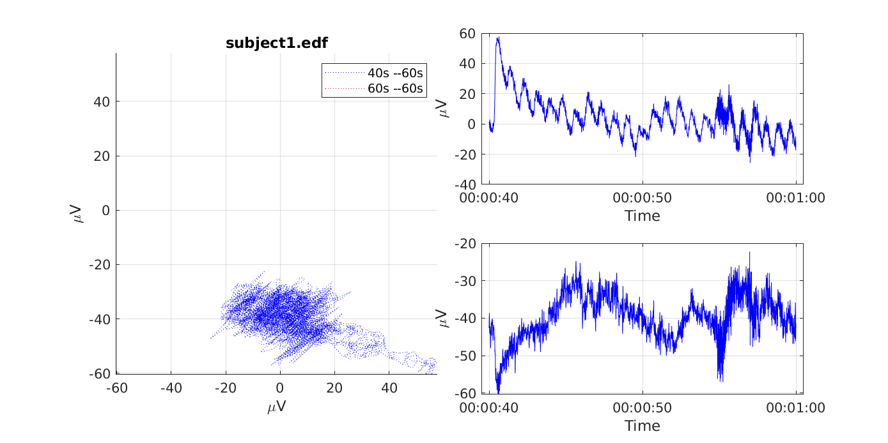
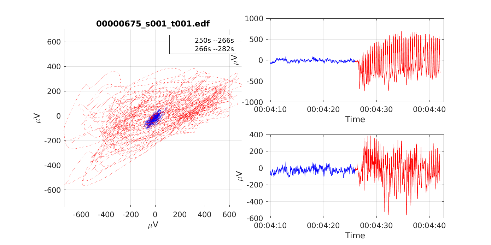
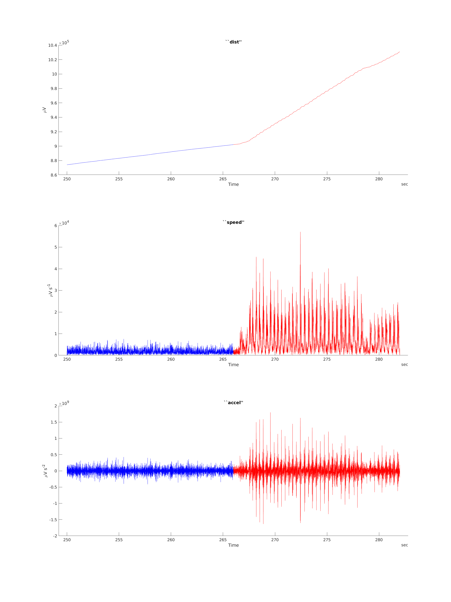
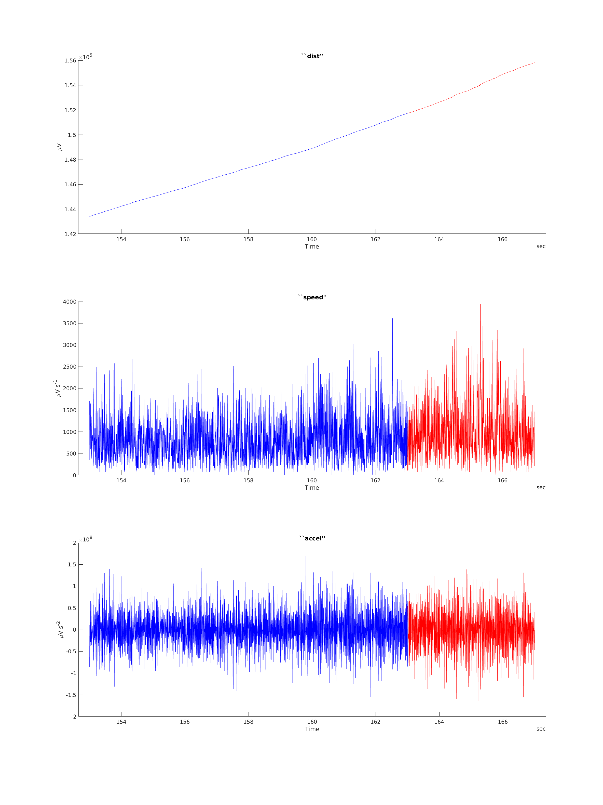
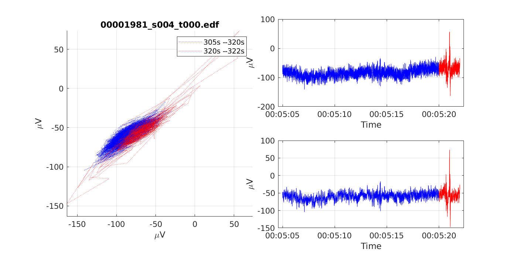
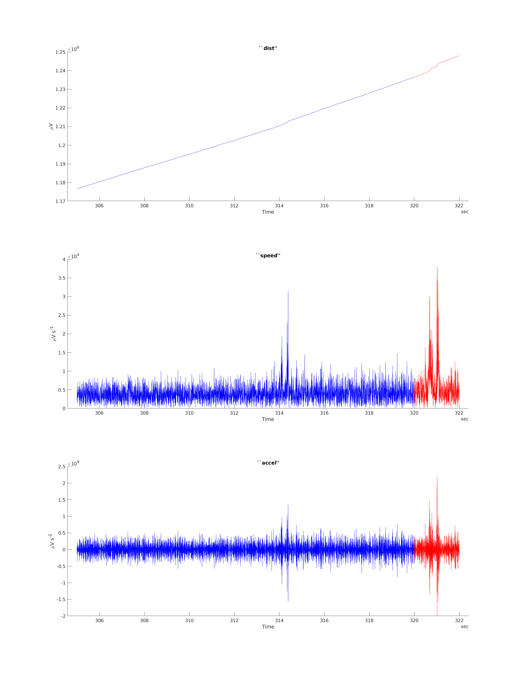
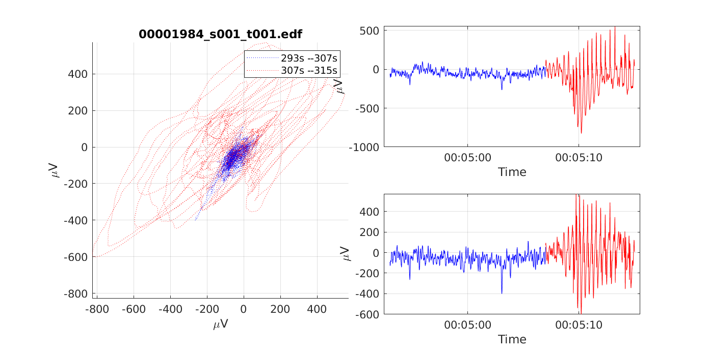

[Link to my dropbox folder with plots and data](https://www.dropbox.com/sh/c015795exltemlg/AACA4GcQZ2y3XLIIyuBh2GSea?dl=0)

[Link to database website](https://www.isip.piconepress.com/projects/tuh_eeg/html/downloads.shtml)

* Submit form for access (name, university, and email)

## Software to use:

* EDF browser to scan through data
* MATLAB to do basic manipulation and plotting
  * [MATLAB function for reading EDFs](https://au.mathworks.com/matlabcentral/fileexchange/31900-edfread?s_tid=mwa_osa_a)
  * EEG toolboxes already present, might be worth checking these out
  * Plotting and coding interface is clunky, but at least it works
* Python
  * Haven't explored this yet, but there seem to be more developed packages specific to this project here
* R for more data-focused approach
  * Seems to be the least supported platform, will come here if needed for particular functions
  * [eegUtils summary](https://www.mattcraddock.com/blog/2017/09/05/eegutils-an-r-package-for-eeg/), check [github](https://github.com/craddm/eegUtils) as well

## Directory structure

Here I'm only looking at the `./dev/` data subset, which is much smaller but gives a representative snapshot of the full training set.

```bash
.
├── _DOCS  # Contains detailed documentation
│   └── parameter_files
├── edf  # Contains EDF, LBL (TCP channel configuration)
│   └── dev
│       ├── 01_tcp_ar  # average reference montage, ref is avg of some electrodes
│       │   ├── 002  # arbitary identifier (3 leading digits of patient id)
│       │   │   └── 00000258  # patient number
│       │   │       ├── s002_2003_07_21  # session number and date of record
│       │   │       └── s003_2003_07_22
│       │   ├── 006
│       │   │   └── 00000629
│       │   │       ├── s003_2003_07_23
│       │   │       └── s004_2003_07_24
..		..	..
│       │   ├── 045
│       │   │   └── ...
..      ..  ..
│       │   └── 108
│       │       └── 00010861
│       │           └── s001_2013_11_16
│       ├── 02_tcp_le  # linked ears montage, ref is electrods on ears
│       │   ├── 002
│       │   │   └── 00000258
│       │   │       ├── s001_2003_07_16
│       │   │       └── s004_2003_07_24
│       │   ├── 006
│       │   │   └── ...
..      ..  ..
│       │   └── 059
│       │       └── ...
│       └── 03_tcp_ar_a  # ar montage without auriculuar channels
│           ├── 022
│           │   └── 00002297
│           │       ├── s003_2007_10_23
│           │       └── s004_2007_10_23
│           ├── 040
│           │   └── ...
..			..
│           └── 065
│               └── 00006546
│                   ├── s010_2011_02_15
│                   ├── ...
│                   └── s016_2011_03_15
└── feats  # Contains RAW (ignore for now)
    └── ...

```

Each folder contains a clinical report (TXT)

### Importing annotations into EDFbroswer

`Tools -> Import annotations/events`

EDFbrowser cannot read the annotations provided, since they're in a *.TSE format. But this is an ascii file, the extension shouldnt' matter. I tried renaming some files to *.CSV and this worked without any issues once I told EDFbrswer how to parse the *.CSV:

* `Column seperator: ' '`
* `Onset column: 1`
* `Onset column: 3`
* `Data starts at line: 3`
* `Onset time coding : seconds, relative to start`

I wrote a simple bash script `tse2csv.sh` to automate this renaming process. Run this script from `tuh-data/edf/`

```bash
user@pc:~/Workspace/data/tuh-data$ cd edf/
user@pc:~/Workspace/data/tuh-data/edf$ cat tse2csv.sh

for d in $(find . -maxdepth 4 -mindepth 4 -type d)
do
  #Do something, the directory is accessible with $d:
  echo $d
  for i in $(find $d -name *.tse)
  do
	  #echo ${i[@]:0:-4}.csv
	  echo $i
	  cp $i ${i[@]:0:-4}.csv
  done
done

user@pc:~/Workspace/data/tuh-data/edf$ bash tse2csv.sh
```

## List of patients to check out:

For this first report, I'll only consider LE montages with generalised seizures and only look at Fz, Pz, and Cz electrodes

Plots below are snippets of regions of interest in the TUH dataset.

* Blue: "non-seizure" activity
* Red: "seizure" activity

Determining this transition is a highly subjective process of inspection by a mathematics PhD student with limited knowledge on EEG analysis, guided by the annotations accompanying the data.

***

### [FIG01] : subject1 (FROM SEPERATE DATASET) : non-epilepsy example




***

### [FIG02] : 00000629_s001_t000 : background slowing


***

### [FIG03] : 00000675_s001_t001 : Absence seizures


***

### [FIG04] : 00000675_s001_t002 : Absence seizures




***

### [FIG05] : 00000795_s001_t002 : background (spike and waves)

* Spikes in red, but difficult to tell apart from preceding activity, same "magnitude" of migration


***

### [FIG06] : 00001278_s001_t001 : generalised slowing

- Spikes and waves in red




***

### [FIG07] : 00001770_s003_t000 : Tonic clonic seizure

- Most of this record is seizure, but doesn't show up much on EEG


***

### [FIG08] : 00001981_s004_t000 : background

* (spike-wave in red)




***

### [FIG09] : 00001984_s001_t001 : absence seizures




***

(Left off at `./edf/dev/02_tcp_le/022`, this should be a good initial sample)


